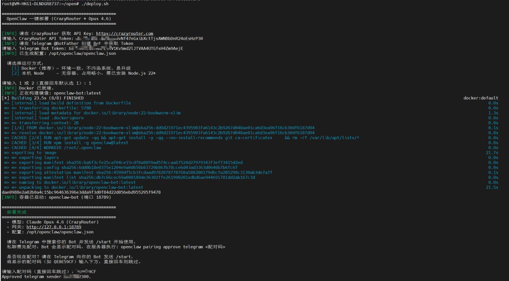
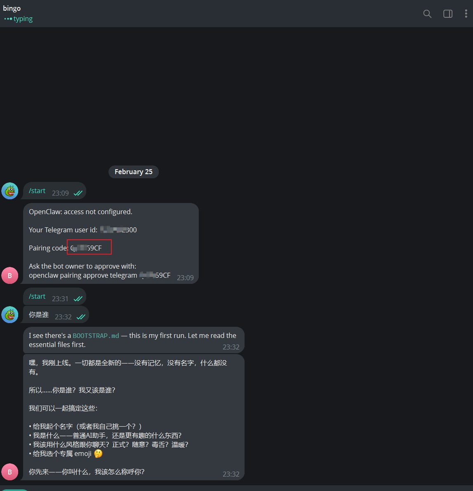

# OpenClaw 一键部署（Breakout 版）

在新服务器上一条命令部署 OpenClaw Telegram Bot，**必须使用 Breakout**，支持 Claude / OpenAI 格式 / Gemini 三种模型。

> **系统要求：** Linux 服务器（推荐 Ubuntu 20.04+/Debian 11+），Windows/macOS 暂不支持。

## 需要填写

1. **Breakout API Token** — 在 [Breakout](https://breakout.wenwen-ai.com) 注册并获取
2. **Telegram Bot Token** — 在 Telegram 找 @BotFather 创建 Bot 后获取

## 快速开始

```bash
curl -fsSL https://breakout.wenwen-ai.com/deploy.sh | bash -s -- "你的BREAKOUT_API_KEY" "你的TELEGRAM_BOT_TOKEN"
```

按提示依次：

1. ~~输入 Breakout API Token~~（已通过参数传入，自动跳过）
2. ~~输入 Telegram Bot Token~~（已通过参数传入，自动跳过）
3. 选择模型类型：**1) Claude（推荐）** / **2) OpenAI 格式** / **3) Gemini**，并可自定义模型 ID
4. 选择运行方式：**1) Docker（推荐）** 或 **2) 本机 Node**（直接回车默认选 1）
5. 部署完成后，**可选配对**：在 Telegram 向 Bot 发送 `/start`，把 Bot 回复里的配对码输入脚本提示，即可完成私聊配对

脚本会根据选择检测/安装 Docker 或使用本机 Node，生成 `openclaw.json` 并启动。

## 支持的模型格式

| 类型 | API 格式 | 示例模型 |
|------|---------|---------|
| Claude 系列 | anthropic-messages | `claude-sonnet-4-6`、`claude-opus-4-6` |
| OpenAI 格式 | openai-completions | `gpt-4o`、`deepseek-chat`、`moonshot-v1-8k` |
| Gemini 系列 | google-generative-ai | `gemini-3-flash-preview` |

## 部署效果

### 终端部署过程



### Telegram Bot 配对成功



## 环境变量（可选）

| 变量 | 说明 | 默认值 |
|------|------|--------|
| `BREAKOUT_API_KEY` | Breakout API Key，预设则跳过交互 | - |
| `TELEGRAM_BOT_TOKEN` | Telegram Bot Token，预设则跳过交互 | - |
| `BREAKOUT_MODEL_TYPE` | 模型类型，预设则跳过交互（`claude` / `openai` / `gemini`） | - |
| `BREAKOUT_MODEL_ID` | 模型 ID，预设则跳过交互 | - |
| `BREAKOUT_MODEL_NAME` | 模型显示名称（配合 `BREAKOUT_MODEL_ID` 使用） | 同 Model ID |
| `OPENCLAW_DATA_DIR` | 数据目录 | `/opt/openclaw` |
| `OPENCLAW_PORT` | 网关端口 | `18789` |
| `USE_DOCKER` | `1` 强制 Docker，`0` 强制 Node | 交互询问 |
| `PREFER_NODE` | 非交互环境下 `1` 优先 Node | `0` |

### 非交互式部署示例

```bash
# 全程无需手动输入，直接部署 Claude Sonnet 4.6
BREAKOUT_API_KEY=your_key \
TELEGRAM_BOT_TOKEN=your_bot_token \
BREAKOUT_MODEL_TYPE=claude \
USE_DOCKER=1 \
sudo ./deploy.sh
```

## 文件说明

| 文件 | 说明 |
|------|------|
| `deploy.sh` | 一键部署脚本 |
| `Dockerfile` | 构建 `openclaw-bot:latest` 镜像 |
| `images/` | README 配图 |

## 相关链接

- [Breakout](https://breakout.wenwen-ai.com) — AI API 网关
- [OpenClaw](https://github.com/openclaw/openclaw) — 开源 AI 助手框架

## License

MIT
